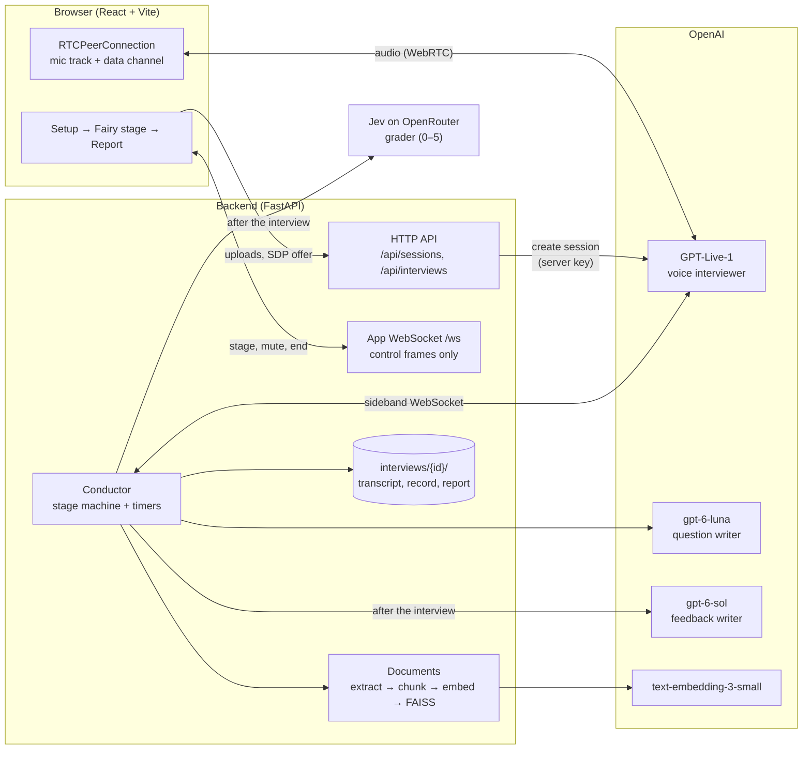
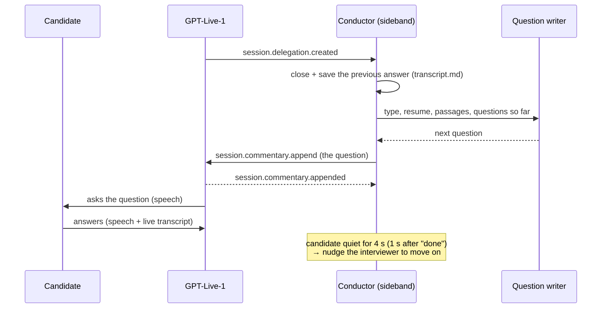
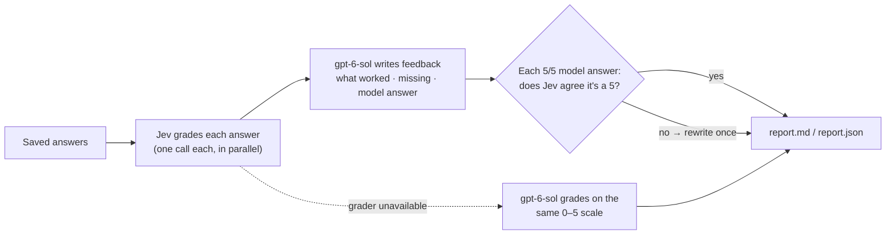

# Dev Fairy: a voice mock-interview agent

Practise a job interview out loud, hands-free, in the browser. A real-time voice interviewer asks
questions drawn from **your** resume and study material, then you get a written report that scores
each answer from 0 to 5 and gives the exact words that would have earned a 5.

Pick **HR** or **technical**, **English** or **Português (Brasil)** (the PT-BR interface is called
*Fada dos Devs*), the role and the seniority. Then press **Start interview** and talk. You can
interrupt the interviewer at any time, because the voice model (OpenAI **GPT-Live-1**) is full duplex.

- **Grounded questions**: they come from your resume and from passages retrieved (FAISS) out of the
  reference files you upload.
- **Pitched at your level**: Junior, Mid-level or Senior affects the questions and the grading.
- **Nothing to click during the interview**: questions are spoken, never shown as text. Say
  *"let's end the interview"* when you're done.
- **Answer-by-answer feedback**: a score, what worked, what was missing and a model answer. You can
  download it as Markdown next to the full transcript.

---

## Quick start

You need **Python 3.11** (3.12+ isn't supported), **Node.js 18+**, desktop **Chrome** with a
microphone, and an **OpenAI API key** with access to `gpt-live-1`, `gpt-6-luna`, `gpt-6-sol` and
`text-embedding-3-small`.

```bash
# 1. Backend
python3.11 -m venv .venv && source .venv/bin/activate
pip install -e ".[dev]"

# 2. Keys: src/.env is read wherever you start the app from
cp src/.env.example src/.env      # then set OPENAI_API_KEY (OPENROUTER_API_KEY is optional)

# 3. Frontend: use npm ci, because the committed node_modules is incomplete
cd frontend && npm ci && npm run build && cd ..

# 4. Run
python src/app.py
```

Open **http://localhost:8000** and allow the microphone. If the key is missing or can't use GPT-Live,
the setup screen says so and **Start interview** stays disabled.

Frontend development with hot reload: `cd frontend && npm run dev`, then open http://localhost:5173
(`/api` and `/ws` are proxied to :8000).

**Docker:** `docker compose up --build`, then open **http://localhost** (nginx serves the UI and
proxies to the backend). The key is passed in through `env_file: src/.env` and never copied into an
image. `./interviews` is mounted, so reports outlive the container.

---

## Using it

1. **Set up**: language, interview type, role (optional) and seniority. If you upload a resume, the
   app suggests the role and seniority for you, but it never overwrites anything you entered.
   - Resume: PDF, DOCX, TXT or Markdown, up to 5 MB.
   - Reference material: PDF, TXT, EPUB or Markdown, up to 5 files and 20 MB in total. To use a
     website, save it as a PDF first.
2. **Interview**: the interviewer introduces itself, asks if you're ready, then asks one question at
   a time. Pause to think if you need to. **Mute** is there when you need a moment.
3. **End it** in any of these ways: say *"let's end the interview"* / *"vamos encerrar a entrevista"*,
   press **End interview**, or stay silent for 3 minutes. A dropped connection also ends it, and the
   answers saved so far are still evaluated.
4. **Read the report**: it appears on screen within about a minute, with **Download report** and
   **Download transcript**.

Every interview is saved in `interviews/{YYYYMMDD-HHMMSS-type-xxxxxx}/`:

| File | Contents |
|---|---|
| `transcript.md` | Questions and your answers, updated after every answer |
| `record.json` | The same, structured (timings, follow-ups, delegations) |
| `report.md` / `report.json` | Per-question score (0–5), what worked, what was missing, model answer, overall summary |

The setup screen links to your last interview, even after you reopen the browser.

---

## Architecture

The design has one idea at its core: **audio never passes through the backend**. The browser
streams voice directly to OpenAI over WebRTC. The backend creates the session with its own key,
attaches a *sideband* control connection to that same session, and conducts the interview from there.



### Three agents, separate jobs

| Agent | Model | Job |
|---|---|---|
| Voice interviewer | `gpt-live-1` | Talks with you: introduction, readiness check, asking questions, clarifying. Its instructions forbid writing its own questions or giving any evaluation. |
| Question writer | `gpt-6-luna` | Writes each next question from the type, language, role, seniority, resume, retrieved reference passages and the questions already asked. |
| Evaluation | Jev (`~typesafe/jev-latest`) + `gpt-6-sol` | After the interview, Jev grades each answer and `gpt-6-sol` writes the feedback. |

### One question cycle

Questions only come in through **delegation**: when the interviewer needs its next question, it hands
the turn to the backend, and the conductor (`src/interview/conductor.py`) handles it.



A few rules shape this loop:

- **HR interviews never see your answers.** The question writer only gets the questions already asked,
  so it can't follow up. In testing, models followed up whenever the answers were visible.
  Technical interviews do get the last Q/A, plus up to 4 unused reference passages.
- **HR questions are written ahead of time**, right after each question is asked, so there's no wait.
- **The Q/A boundary is timestamp-based**: an answer is the candidate's transcript from the moment
  one question is asked until the next one is (`src/interview/record.py`). Every write is atomic.
- **End of turn**: GPT-Live has no end-of-turn setting, so the conductor watches for silence and nudges
  the interviewer, never while a question is pending or you're muted.

### Evaluation

The evaluation runs once the interview ends (except when you close the tab), provided at least one
answer was saved. The code is in `src/evaluation/`.



- Jev is a *decisions* model: it returns a score and rubric diagnostics but can't write text, so the
  two models split the job. Scores are used exactly as Jev returns them.
- One call per answer: batched grading inflated and flattened the scores (measured, see
  `specs/004-exact-answer-feedback/research.md`).
- With no `OPENROUTER_API_KEY` (or if Jev fails), the whole report falls back to `gpt-6-sol`'s own
  grades, and the report says so.
- Your answers in `report.md` are quoted from the saved record, never from a model's output.

### Why it's built this way

The design decisions were measured and recorded, and `research.md` in each spec explains them:

| Decision | Why |
|---|---|
| WebRTC + sideband instead of proxying audio | Lower latency, the browser's echo cancellation, and the API key stays on the server. Sidebands only attach to WebRTC sessions. |
| The conductor owns the questions, not the voice model | Keeps questions grounded, prevents repeats (`difflib` ≥ 0.9 check), and gives a clean Q/A boundary for grading. |
| Resume in the prompt, references in FAISS | A resume fits in context (capped at 12,000 chars). Reference books don't, so they're chunked (~1,200 chars, 200 overlap) and retrieved. |
| `LIVE_CONTROL=browser_relay` fallback | If the sideband is unavailable, the browser forwards data-channel events over the app WebSocket. |

---

## Configuration

Everything is read from `src/.env` (see `src/config.py`). Only `OPENAI_API_KEY` is required.

| Variable | Default | Purpose |
|---|---|---|
| `OPENAI_API_KEY` | — | **Required.** Never sent to the browser, a response or a log. |
| `OPENROUTER_API_KEY` | — | Enables the Jev grader. Without it, `gpt-6-sol` grades. |
| `OPENROUTER_GRADER_MODEL` | `~typesafe/jev-latest` | Grader model |
| `OPENAI_LIVE_MODEL` / `OPENAI_LIVE_VOICE` | `gpt-live-1` / `marin` | Voice interviewer |
| `OPENAI_QUESTION_MODEL` | `gpt-6-luna` | Question writer |
| `OPENAI_EVALUATOR_MODEL` | `gpt-6-sol` | Feedback writer |
| `OPENAI_EMBED_MODEL` | `text-embedding-3-small` | Reference embeddings |
| `LIVE_CONTROL` | `sideband` | `sideband` or `browser_relay` |
| `INTERVIEWS_DIR` | `./interviews` | Where transcripts and reports are saved |
| `INACTIVITY_END_SECONDS` | `180` | Silence from both sides that ends the interview |
| `ANSWER_END_SILENCE_SECONDS` | `4` | Candidate silence before the interviewer is nudged to move on |
| `REFERENCE_MAX_CHUNKS` | `8000` | Cost guard on indexed reference chunks |
| `API_HOST` / `API_PORT` / `LOG_LEVEL` | `0.0.0.0` / `8000` / `INFO` | Server |

**Privacy:** your voice, your answers and the text of your uploads are sent to OpenAI (and your
answers to OpenRouter when Jev is enabled). Uploads and the reference index live in memory and are
dropped when the session ends. Transcripts and reports stay on your machine.

**Cost:** GPT-Live-1 is billed per minute while the interview runs (about $0.05/min, so roughly
$1.50 for 30 minutes). Question writing, grading, feedback and embeddings add a few cents.

---

## API

| Method | Path | Purpose |
|---|---|---|
| `GET` | `/api/status` | Can the interviewer start? `ok`, `missing_key`, `invalid_key`, `model_unavailable` or `unavailable` |
| `POST` / `GET` | `/api/sessions/{id}/documents` | Upload / list the resume and reference files (setup only). The resume upload returns a role/seniority `suggestion`. |
| `POST` | `/api/sessions/{id}/live` | Start: `{interview_type, language, role?, seniority?, sdp}` → `{sdp, live_session_id, interview_id}` |
| `GET` | `/api/interviews/{id}` | Summary of a saved interview |
| `GET` | `/api/interviews/{id}/transcript` | `transcript.md` |
| `GET` | `/api/interviews/{id}/report` | `report.md`, or `report.json` with `?format=json` |
| `GET` | `/health` | Liveness + OpenAI status |

The app WebSocket `/ws/{session_id}` carries control frames only, never audio or question text.
- Client → server: `end_interview`, `mic_muted`, `live_disconnected`.
- Server → client: `interview_stage`, `delegation_pending`, `question_asked`, `answer_saved`,
  `report_status`, `error`.

Full contracts: [`specs/002-gpt-live-interview/contracts/`](specs/002-gpt-live-interview/contracts/).

---

## Project structure

```
src/                         Python backend (FastAPI)
├── app.py                   entry point; serves frontend/dist when built
├── config.py                settings from src/.env
├── openai_client.py         OpenAI clients + key check
├── openrouter_client.py     OpenRouter client for the grader
├── api/                     HTTP routes, app WebSocket, in-memory sessions
├── live/                    GPT-Live session creation, sideband / browser-relay control, events
├── interview/               conductor, stage machine, record, question writer, prompts,
│                            stop phrases, resume reader (role/seniority suggestion)
├── evaluation/              grader (Jev), evaluator (writer + checks), rubric, report rendering
└── documents/               extraction, chunking, embeddings, FAISS index, upload limits
frontend/src/                React + TypeScript
├── App.tsx                  setup → fairy stage → report
├── components/              SetupScreen, pickers, Fairy (canvas), ReportPanel, TopBar, …
├── hooks/                   useLiveSession (WebRTC), useVoiceSession (app WS), useDocuments
├── services/                API and WebSocket clients
└── i18n.ts                  all interface text, EN + PT-BR
tests/                       unit/ and contract/ (offline, faked), integration/ (real API)
specs/                       001–004: spec, plan, research, data model, contracts, tasks
```

The visual system (night-atlas ground, hairline plates, one red lamp, the fairy) is described in
[DESIGN.md](DESIGN.md), and the product context in [PRODUCT.md](PRODUCT.md).

---

## Tests

```bash
# Unit + contract: offline, no key needed (GPT-Live, the agents and embeddings are faked)
PYTHONPATH=. .venv/bin/python3.11 -m pytest tests/unit/ tests/contract/ -v

# Integration: real OpenAI calls, skipped without OPENAI_API_KEY (costs fractions of a cent)
PYTHONPATH=. .venv/bin/python3.11 -m pytest tests/integration/ -v
```

The conductor is tested directly against a scripted fake GPT-Live (`tests/fakes.py:FakeLiveControl`),
with no browser and no network.

---

## Troubleshooting

| Symptom | Likely cause | Fix |
|---|---|---|
| "No OpenAI API key is configured" | `src/.env` is missing, or has no `OPENAI_API_KEY` | Add it and restart |
| "This OpenAI account can't use the gpt-live-1 model" | The key works, but the account has no access to the model | Check the account's model access |
| The report says it was graded by the writer | No `OPENROUTER_API_KEY`, or Jev failed | Add the key for Jev grading (optional) |
| "The connection to the interviewer was lost" | The network dropped mid-interview | Saved answers are kept and evaluated. Start a new interview |
| The interviewer hears itself | Speakers without echo cancellation | Use Chrome, or headphones |
| "…has no readable text" | A scanned / image-only PDF | Upload a version with selectable text |
| `tsc` / `vite` fail with `MODULE_NOT_FOUND` | Running from the incomplete committed `node_modules` | `cd frontend && npm ci` |
| Blank page on :8000 | The frontend isn't built | `cd frontend && npm run build` |

---

## Built with

[OpenAI](https://developers.openai.com) (GPT-Live-1, Responses API, embeddings) ·
[OpenRouter](https://openrouter.ai) (Jev) · [FAISS](https://github.com/facebookresearch/faiss) ·
[FastAPI](https://fastapi.tiangolo.com) · [React](https://react.dev) + [Vite](https://vitejs.dev) ·
`pypdf`, `python-docx`
